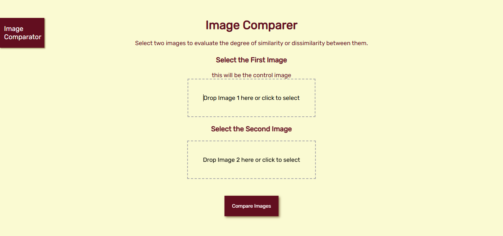
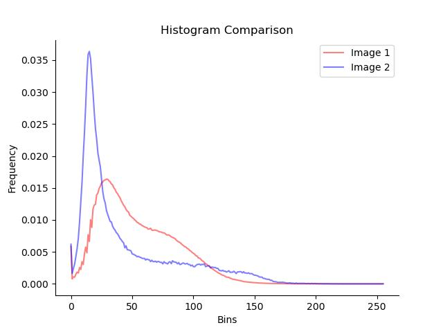

# Image Comparator

### **What it is?**
The Image Comparator serves to do exactly what the name says: compare images. 
The user selects two images and clicks the 'compare images' button. 
Then it is redirected to a page with metrics and statistics that evaluate the similarity or not between the images.

  

### **How it works?**
Install the requirements.txt. 
> pip install -r requirements.txt

Preferably in a virtual environment, and in this case activated it.
After that, using the prompt in the folder where the app is, type:
> python app.py

Copy and paste the http link into your browser and enjoy.

or

### Using Docker
> docker build -t image_comparator .

> docker run -p 8080:8080 image_comparator

## Metrics

### **Structural Similarity Index Measure (SSIM)**
The SSIM (Structural Similarity Index) score is a metric used to measure the similarity between two images, by quantifying the structural similarity between the pixel intensities of the images, taking into account the perceived changes in structural information, luminance and contrast. 

### **Mean Squared Error (MSE) and Root Mean Squared Error (RMSE)**
The MSE is the mean of the squared differences between the predicted values and the actual values, and is obtained by summing the squares of the errors and dividing by the total number of data points, with the RMSE being the square root of the MSE.  
The result is an error value that represents the mean squared difference between the predicted and actual values. 

### **Histogram Comparison**

  

 

Histogram-based methods compare the distribution of pixel intensities in two images, and the result of the histogram comparison is a value that indicates similarity or dissimilarity. 
Some common techniques when using the histogram:Correlation, Chi-Square, Intersection and Bhattacharyya. 

### **Feature Extraction and Matching**

  

 

This approach involves extracting features from images (e.g., keypoints, descriptors) and then matching them between the two images. 
Popular feature extraction algorithms include Scale-Invariant Feature Transform (SIFT), Speeded-Up Robust Features 
(SURF), and Oriented FAST and Rotated BRIEF (ORB). 
The similarity score is based on the number of matches, in this case it is the match count and here SIFT was used 
due to its high accuracy.

### **Normalized Cross-Correlation (NCC)**
The NCC score provides a measure of the linear relationship between the pixel intensities of the two images, 
indicating how well the pixel intensities in one image can be predicted from the intensities in the other image. 
The NCC score is a value that quantifies the degree of correlation or resemblance between the images, but  it does 
not consider spatial information or the arrangement of pixels. 
The resulting Normalized Cross-Correlation value represents the similarity or dissimilarity between the two images, 
with values ranging from -1 to 1. 

### **Mutual Information (MI)**
Mutual Information is a measure of statistical dependence that quantifies how much knowing the pixel intensities in 
one image reduces the uncertainty about the pixel intensities in the other image. 
The obtained MI score can be interpreted as the level of similarity between the two images based on 
their pixel intensities, where a higher MI score indicates a higher level of shared information and therefore 
suggests a greater degree of similarity between the images.
